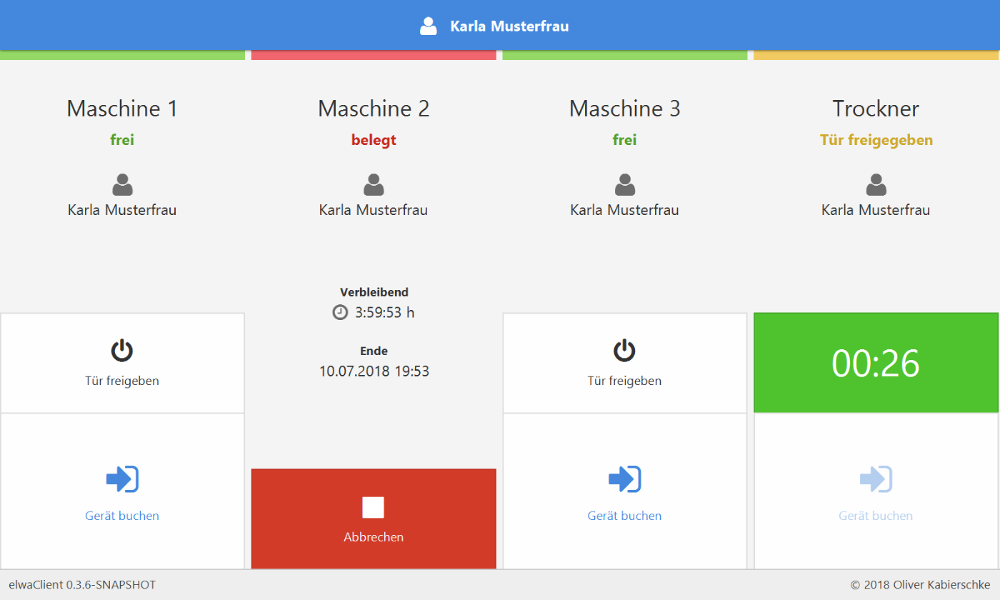
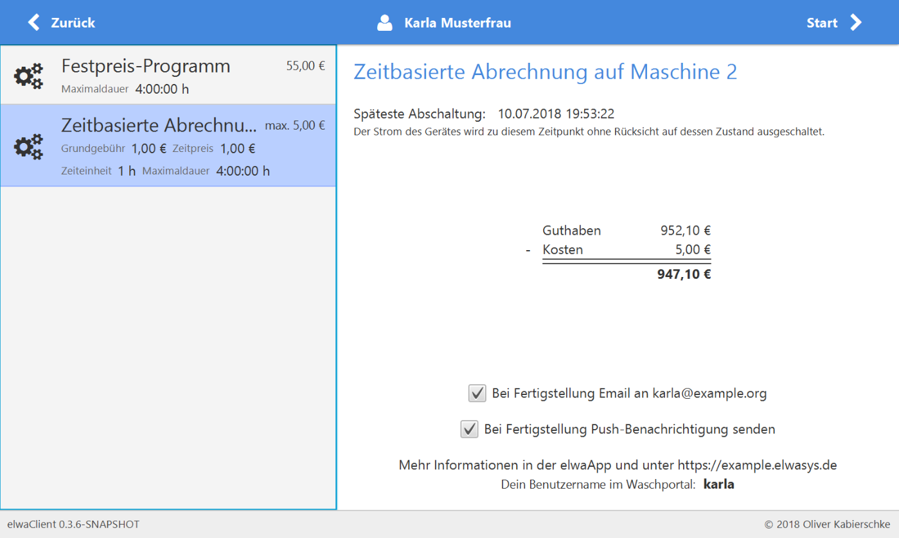

# elwasys #





The elwasys client was developed to run on a RaspberryPi with the official 7" touch screen.
It controls wireless sockets that are plugged in front of the managed washing machines.

It uses the [ConBee2](https://phoscon.de/de/conbee2) stick to communicate with Zigbee smart plugs (e.g. [LIDL SilverCrest](https://www.lidl.de/p/silvercrest-3er-set-steckdosen-zwischenstecker-zigbee-smart-home-mit-energiezaehler/p800003184)).
The wireless sockets are switched on if a user has enough credit and are switched off again when the washer is done.

## Features

- Use RFID Cards to identify users at the terminal
- Pre-Paid washing
- Detect end of program by measuring power consumption (=> vendor independent)
- Email- and push-notification when the laundry is ready
- Fixed price or time-based billing
- Fine-grained permissions
  - Special prices per user group
  - Deny access to a washing machine for a certain user group

## Setup

On a fresh Raspberry Pi, run the following command:

```bash
bash <(curl -s https://raw.githubusercontent.com/kabieror/elwasys/master/Client-Raspi/setup.sh)
```